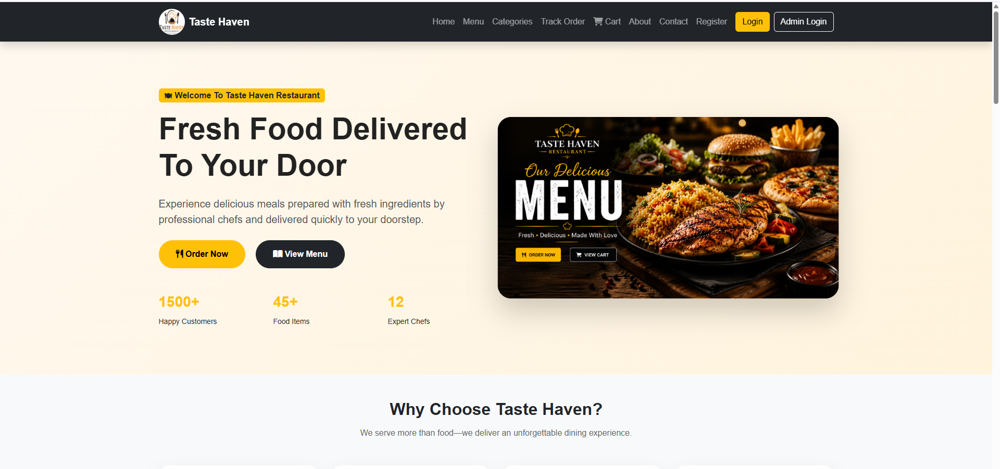
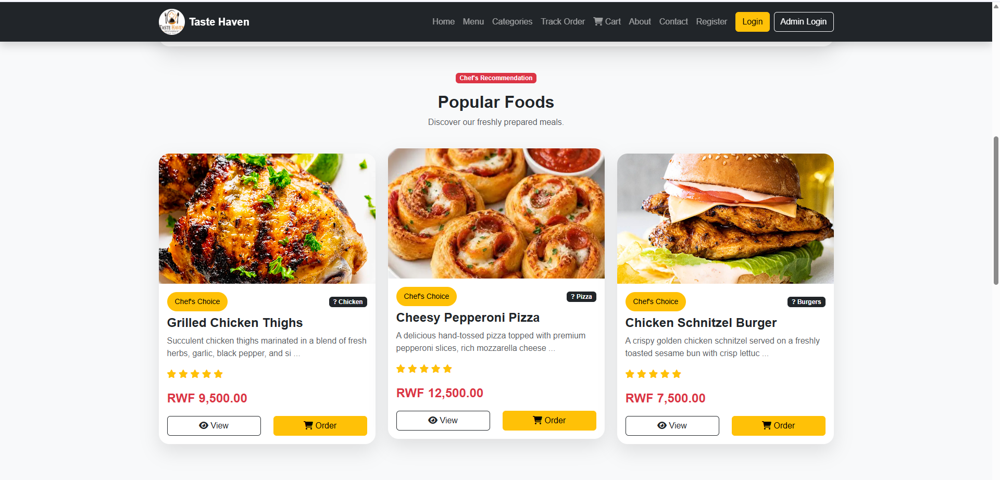
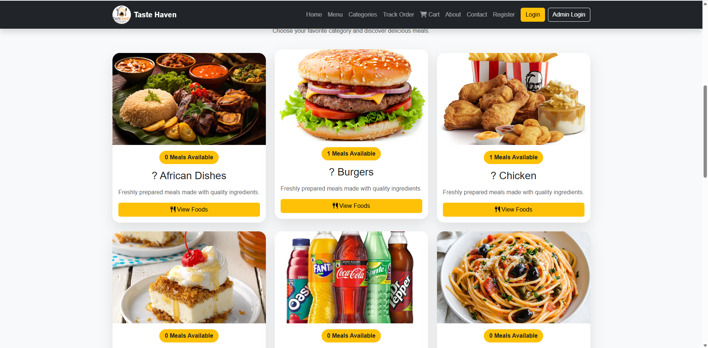
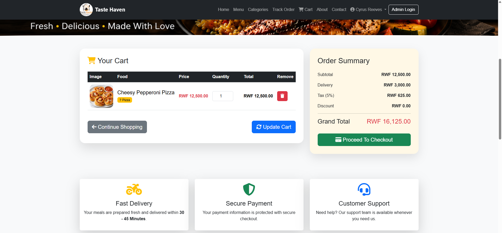
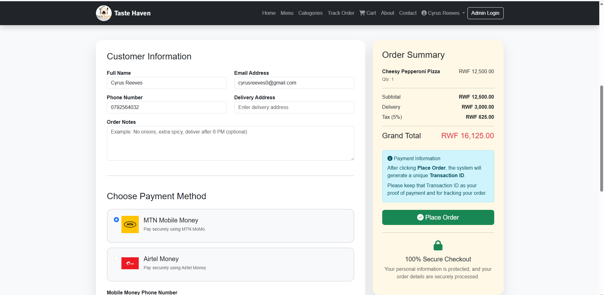
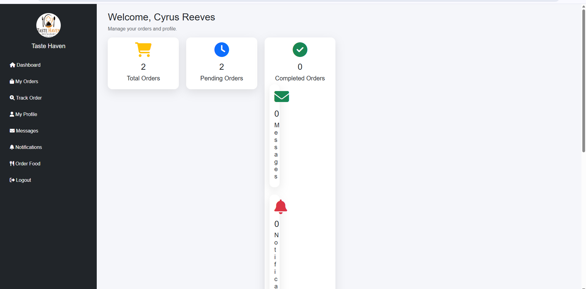
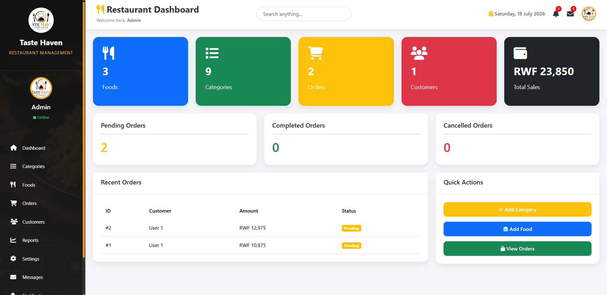
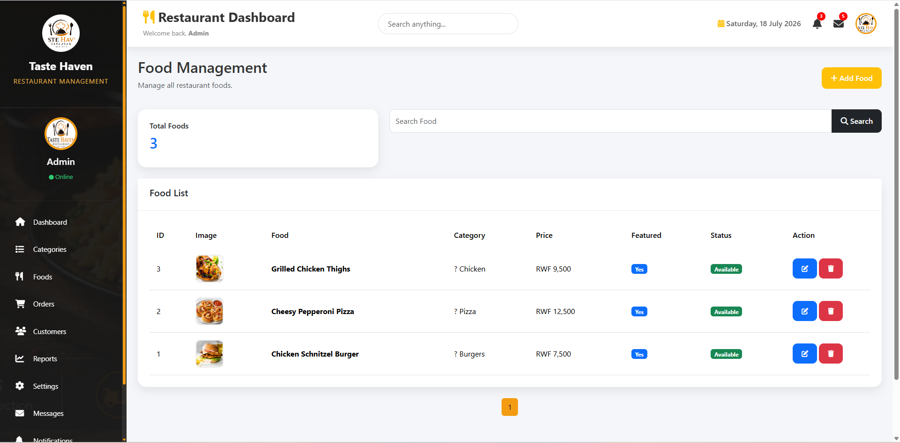
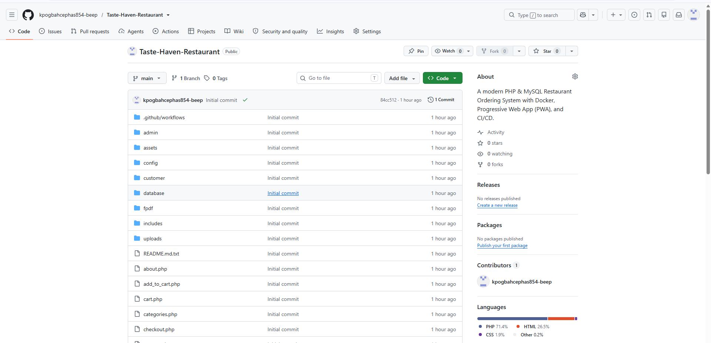

TASTE HAVEN RESTAURANT
Final Project Report
University of Lay Adventists of Kigali (UNILAK)
Faculty of Computing and Information Sciences
Course Code

EWA408510

Course Title

E-Commerce and Web Application

Taste Haven Restaurant
A Complete Restaurant Ordering System Developed Using PHP and MySQL
Submitted By

Student Name: Cephas M. Kpogbah

Registration Number: 23524/2023

Submitted To

Lecturer: Eric Maniraguha

Academic Year

2025–2026

Table of Contents
Introduction
Project Background
Problem Statement
Project Objectives
Scope of the Project
System Features
Functional Requirements
Non-Functional Requirements
Technologies Used
Project Structure
Database Design
System Workflow
Customer Module
Administrator Module
Security Features
Testing
Docker Implementation
GitHub Repository
Continuous Integration (CI/CD)
Progressive Web Application (PWA)
Installation Guide
System Screenshots
Challenges Encountered
Future Enhancements
Conclusion
References
Acknowledgement
1. Introduction

The rapid growth of electronic commerce has significantly transformed the food service industry by enabling customers to browse restaurant menus, place food orders, and track deliveries online. Traditional restaurant ordering methods often require customers to visit the restaurant or make phone calls, which can be inconvenient, time-consuming, and prone to errors.

The Taste Haven Restaurant Ordering System is a web-based e-commerce application developed to provide customers with a simple, secure, and efficient online food ordering experience. The system enables customers to browse available meals, add food items to a shopping cart, complete the checkout process, and track their orders from any location with internet access.

The application also provides a comprehensive administration panel where restaurant administrators can manage food items, categories, customer accounts, orders, website settings, and business reports. This project demonstrates the practical application of modern web development technologies studied in the E-Commerce and Web Application course.

The project was developed using PHP, MySQL, HTML5, CSS3, Bootstrap 5, JavaScript, Git, GitHub, Docker, GitHub Actions (CI/CD), and Progressive Web Application (PWA) technologies to ensure scalability, portability, and a modern user experience.

2. Project Background

Many restaurants continue to rely on traditional methods of taking customer orders, including face-to-face ordering and telephone reservations. These approaches often result in long waiting times, inaccurate order processing, limited customer convenience, and inefficient management of restaurant operations.

As the demand for online services continues to grow, restaurants require modern digital platforms that allow customers to browse menus, place food orders, and receive timely services without visiting the restaurant physically.

The Taste Haven Restaurant Ordering System was developed to address these challenges by providing a centralized online platform where customers can view available meals, add food items to a shopping cart, place orders, and monitor their order status. Restaurant administrators can efficiently manage food items, categories, customer accounts, incoming orders, reports, and website settings through a secure administration dashboard.

The system improves customer satisfaction, enhances operational efficiency, reduces manual errors, and demonstrates the practical implementation of modern e-commerce technologies for restaurant businesses.

3. Problem Statement

Many restaurants experience operational challenges because they depend on manual ordering processes and paper-based record management. Customers are often required to visit the restaurant physically or place orders through phone calls, making the ordering process slow, inconvenient, and susceptible to communication errors.

Restaurant administrators also face challenges in managing food items, monitoring customer orders, updating menus, generating sales reports, and maintaining accurate customer information. Manual processes increase workload, reduce efficiency, and make it difficult to provide high-quality customer service.

The Taste Haven Restaurant Ordering System was developed to solve these problems by providing a secure, responsive, and user-friendly online platform that simplifies food ordering, improves restaurant management, and enhances customer satisfaction.

4. Project Objectives
4.1 General Objective

To develop a secure, responsive, and user-friendly Restaurant Ordering System that enables customers to browse available meals, place food orders online, and allows administrators to efficiently manage restaurant operations through a centralized web-based platform.

4.2 Specific Objectives
To develop a modern and responsive restaurant website.
To provide customers with an online food ordering platform.
To implement secure customer registration and login.
To allow customers to browse available meals.
To enable customers to add meals to the shopping cart.
To implement a complete checkout process.
To allow administrators to manage food items.
To manage food categories.
To manage customer accounts.
To manage customer orders.
To generate restaurant reports.
To maintain website settings through the administration panel.
5. Scope of the Project

The Taste Haven Restaurant Ordering System consists of both customer and administrator modules.

The customer module provides functionality for browsing available meals, viewing food details, filtering meals by category, adding meals to the shopping cart, registering an account, logging into the system, placing orders, completing the checkout process, viewing order history, tracking orders, and updating personal profile information.

The administrator module provides comprehensive management of restaurant operations, including food management, category management, customer management, order processing, sales reports, website settings, and customer support management.

The project focuses on demonstrating core e-commerce concepts for restaurant businesses while utilizing modern software development technologies such as Docker containerization, GitHub version control, GitHub Actions CI/CD, and Progressive Web Application (PWA) support.

6. System Features

The Taste Haven Restaurant Ordering System provides comprehensive functionality for both customers and restaurant administrators. The system was designed to provide a fast, secure, and user-friendly online food ordering experience while enabling restaurant administrators to efficiently manage restaurant operations through a centralized administration panel.

6.1 Customer Features

The customer module allows users to:

Browse available food items.
View detailed food descriptions and prices.
Browse meals by category.
Search for meals quickly.
Add meals to the shopping cart.
Update food quantities in the shopping cart.
Remove unwanted meals from the shopping cart.
Register a new customer account.
Log in securely.
Complete the checkout process.
Track food orders.
View previous order history.
Update customer profile information.
Contact the restaurant through the Contact page.
6.2 Administrator Features

The administrator module provides complete restaurant management functionality.

The administrator can:

Access a secure administration dashboard.
Add new food items.
Edit existing food items.
Delete food items.
Upload food images.
Manage food categories.
View and process customer orders.
Update order status.
Manage customer accounts.
Manage customer messages.
Generate restaurant reports.
Manage website settings.
Update administrator profile information.
Monitor overall restaurant performance.
7. Functional Requirements

Functional requirements describe the services that the Restaurant Ordering System provides to customers and administrators.

7.1 User Authentication

The system shall:

Allow customers to register.
Allow customers to log in securely.
Allow administrators to log in securely.
Allow users to log out safely.
Restrict unauthorized users from accessing protected pages.
7.2 Food Management

The system shall:

Display available meals.
Display food images.
Display food prices.
Display food descriptions.
Allow administrators to add new food items.
Allow administrators to edit food information.
Allow administrators to delete food items.
7.3 Category Management

The system shall:

Display available food categories.
Allow administrators to add categories.
Allow administrators to edit categories.
Allow administrators to delete categories.
7.4 Shopping Cart

The system shall:

Allow customers to add meals to the shopping cart.
Allow customers to update meal quantities.
Allow customers to remove unwanted meals.
Automatically calculate the order total.
7.5 Checkout

The system shall:

Collect customer delivery information.
Display an order summary.
Validate customer information.
Save customer orders into the database.
Display an order confirmation page.
7.6 Order Management

The administrator shall:

View all customer orders.
Update order status.
Process completed and pending orders.
Monitor restaurant sales.
7.7 Customer Management

The administrator shall:

View registered customer accounts.
Manage customer information.
Monitor customer activities.
7.8 Reports

The system shall generate reports showing:

Total food items.
Total food categories.
Total registered customers.
Total customer orders.
Total restaurant sales.
8. Non-Functional Requirements

Non-functional requirements describe how the system performs its operations.

Performance

The system should load pages quickly and process customer requests efficiently.

Reliability

The application should operate continuously without unexpected failures during normal usage.

Usability

The system should provide a simple, attractive, and user-friendly interface for customers and administrators.

Security

The application should protect customer information using secure authentication, password hashing, session management, and input validation.

Maintainability

The source code should be organized into logical modules to simplify maintenance and future development.

Scalability

The system should support future enhancements such as online payment integration, delivery tracking, table reservations, and inventory management.

Compatibility

The application should function correctly on modern web browsers including:

Google Chrome
Microsoft Edge
Mozilla Firefox
Opera

The website is also fully responsive for desktop, tablet, and mobile devices.

9. Technologies Used

The Taste Haven Restaurant Ordering System was developed using several modern web technologies.

Technology	Purpose
HTML5	Structure of web pages
CSS3	Website styling and layout
Bootstrap 5	Responsive user interface
JavaScript	Client-side interactivity and validation
PHP	Server-side programming
MySQL	Database management
Font Awesome	Website icons
Git	Version control
GitHub	Source code hosting
Docker	Application containerization
Docker Compose	Multi-container management
GitHub Actions	Continuous Integration (CI/CD)
Progressive Web App (PWA)	Mobile application experience
HTML5

HTML5 was used to develop the structure of every webpage, including navigation menus, forms, tables, cards, and content sections.

CSS3

CSS3 was used to design a responsive, attractive, and professional restaurant website while maintaining a consistent visual appearance across all pages.

Bootstrap 5

Bootstrap 5 provided responsive layouts, navigation bars, buttons, cards, tables, forms, alerts, and utility classes that significantly improved user experience and development speed.

JavaScript

JavaScript was used to enhance interactivity through form validation, dynamic page behavior, shopping cart functionality, and improved user experience.

PHP

PHP serves as the server-side programming language responsible for:

User authentication
Session management
Food management
Order processing
Database communication
Business logic implementation
MySQL

MySQL stores all application data including:

Administrator accounts
Customer accounts
Food items
Food categories
Orders
Order details
Customer messages
Website settings
Git and GitHub

Git was used for version control while GitHub was used to host the project's source code, documentation, and version history.

Docker

Docker packages the application and its dependencies into containers, making deployment easier and ensuring consistent execution across different environments.

GitHub Actions (CI/CD)

GitHub Actions was implemented to automate project validation by performing PHP syntax checks whenever changes are pushed to the GitHub repository, helping maintain code quality.

Progressive Web Application (PWA)

The system was enhanced with Progressive Web Application (PWA) functionality by implementing a web manifest, service worker, offline page, and installation support. This allows users to install the application on their devices and access selected features even with limited network connectivity.

10. Project Structure

The Taste Haven Restaurant Ordering System follows a modular folder structure that improves code organization, readability, maintainability, and scalability.

Restaurant-Ordering-System/
│
├── admin/
├── assets/
│   ├── css/
│   ├── js/
│   ├── images/
│
├── config/
├── customer/
├── database/
├── includes/
├── screenshots/
├── .github/
│   └── workflows/
├── Dockerfile
├── docker-compose.yml
├── manifest.json
├── service-worker.js
├── README.md
└── index.php
Folder Description

admin/ – Contains administrator pages such as the dashboard, food management, category management, customer management, orders, reports, and website settings.

assets/ – Stores CSS stylesheets, JavaScript files, icons, images, logos, and uploaded food images.

config/ – Contains the database connection and application configuration files.

customer/ – Contains customer-related pages including login, registration, profile, dashboard, checkout, and order history.

database/ – Stores the SQL database export used to create the restaurant database.

includes/ – Contains reusable components such as the navigation bar, footer, and other shared layouts.

screenshots/ – Stores screenshots used in this project report.

.github/workflows/ – Contains the GitHub Actions workflow for Continuous Integration (CI).

Dockerfile – Defines how the PHP application is built into a Docker image.

docker-compose.yml – Configures and manages the application, MySQL database, and phpMyAdmin services.

manifest.json – Defines the Progressive Web Application metadata.

service-worker.js – Enables offline functionality and caching for the Progressive Web Application.

11. Database Design
11.1 Database Overview

The Taste Haven Restaurant Ordering System uses MySQL as its relational database management system. The database stores all information required for the operation of the restaurant, including administrator accounts, customer accounts, food categories, food items, customer orders, order details, contact messages, notifications, and website settings.

The database was carefully designed using relational principles to minimize data redundancy while maintaining data integrity through primary keys, foreign keys, and relationships between related tables.

11.2 Main Database Tables

The application consists of the following primary tables:

Table Name	Description
admins	Stores administrator login credentials and profile information.
users	Stores registered customer account information.
categories	Stores food categories such as Fast Food, Drinks, Desserts, and Main Courses.
foods	Stores all food items displayed on the restaurant menu.
orders	Stores customer orders and their status.
order_items	Stores the individual food items belonging to each order.
contacts	Stores customer inquiries submitted through the Contact page.
messages	Stores communication between customers and administrators.
notifications	Stores system notifications displayed to users.
settings	Stores website configuration such as restaurant name, contact information, logo, and other settings.
11.3 Database Relationships

The database follows a relational design where tables are connected through foreign keys.

The relationships include:

One category can contain many food items.
One customer can place multiple orders.
One order can contain multiple food items.
One administrator manages food items, categories, customers, and orders.
Customer messages are linked to registered users where applicable.

This design improves data consistency, simplifies reporting, and enhances application performance.

12. System Workflow

The Taste Haven Restaurant Ordering System consists of two primary modules: the Customer Module and the Administrator Module.

12.1 Customer Workflow

The customer follows these steps:

Visit the restaurant homepage.
Browse the food menu.
View detailed information about selected meals.
Add meals to the shopping cart.
Register or log into the system.
Proceed to checkout.
Confirm the order.
Receive an order confirmation.
Track current orders.
View previous order history.

This workflow provides customers with a simple and convenient online food ordering experience.

12.2 Administrator Workflow

The administrator performs the following activities:

Log into the administrator dashboard.
Add or update food items.
Manage food categories.
View incoming customer orders.
Update order status.
Manage customer accounts.
Review customer messages.
Generate reports.
Update website settings.
Monitor restaurant performance through the dashboard.
13. Customer Module

The Customer Module provides all services available to restaurant customers.

Home Page

The Home Page welcomes visitors with an attractive restaurant banner, featured meals, special offers, navigation menus, and quick access to different food categories.

Food Menu

Customers can browse all available meals together with images, prices, categories, and brief descriptions.

Food Details

Each meal has its own detail page displaying additional information such as ingredients, description, price, category, and an option to add the meal to the shopping cart.

Food Categories

Customers can browse meals according to categories such as Breakfast, Lunch, Dinner, Drinks, Desserts, and Fast Food, making it easier to find their preferred meals.

Shopping Cart

The shopping cart allows customers to:

Add meals.
Update meal quantities.
Remove unwanted meals.
View the total order amount before checkout.
Customer Registration

New customers can create personal accounts by providing their personal information.

Customer Login

Registered customers can securely log into the system using their email address and password.

Customer Dashboard

After logging in, customers can:

View profile information.
Track current orders.
View previous orders.
Update account information.
Receive notifications.
Checkout

The checkout page collects delivery details, verifies customer information, displays the complete order summary, and stores the order in the database.

Contact Page

Customers can submit inquiries, complaints, suggestions, or feedback directly to the restaurant through the Contact page.

14. Administrator Module

The Administrator Module provides complete control over restaurant operations.

Administrator Dashboard

The administrator dashboard displays important restaurant statistics, including:

Total Food Items
Total Categories
Total Customers
Total Orders
Pending Orders
Completed Orders
Revenue Summary

The dashboard provides administrators with an overview of restaurant performance through informative cards and reports.

Food Management

Administrators can:

Add new food items.
Edit existing food items.
Delete food items.
Upload food images.
Update prices.
Manage food availability.
Category Management

Administrators can:

Add food categories.
Edit categories.
Delete categories.
Organize meals into appropriate categories.
Order Management

The Order Management module allows administrators to:

View all customer orders.
Review order details.
Update order status.
Mark orders as Pending, Preparing, Delivered, or Cancelled.
Monitor restaurant sales.
Customer Management

Administrators can:

View registered customers.
Manage customer information.
Monitor customer activities.
Review customer order history.
Message Management

Administrators can review customer messages submitted through the Contact page and respond appropriately when necessary.

Website Settings

The Website Settings module allows administrators to update:

Restaurant name
Logo
Contact information
Address
Social media links
Footer information
Website configuration
Reports

The reporting module generates useful restaurant information, including:

Sales reports
Food reports
Customer reports
Order reports
Revenue summaries

These reports assist restaurant managers in making informed business decisions.

15. Security Features

Security was one of the major considerations during the development of the Taste Haven Restaurant Ordering System. Several security mechanisms were implemented to protect customer information, administrator accounts, and restaurant data from unauthorized access and malicious activities.

15.1 Password Hashing

Customer and administrator passwords are securely stored using PHP password hashing techniques instead of plain text. This ensures that even if the database is compromised, user passwords remain protected.

15.2 Session Management

PHP sessions are used to authenticate users after login. Session variables restrict access to protected pages and prevent unauthorized users from accessing customer dashboards and administrator modules.

15.3 Authentication

The system requires customers and administrators to authenticate themselves before accessing restricted areas. Separate authentication mechanisms are implemented for customers and administrators.

15.4 Input Validation

All user input is validated before processing to minimize invalid entries and improve system reliability.

Validation is performed for:

Registration forms
Login forms
Contact forms
Food management forms
Category management forms
Checkout forms
15.5 SQL Injection Prevention

User inputs are sanitized before interacting with the database. Appropriate database handling techniques are used to reduce the risk of SQL Injection attacks.

15.6 Access Control

Administrative pages are accessible only to authenticated administrators. Customers cannot access administrator modules, while administrators have complete control over restaurant management functions.

16. Testing

Testing was carried out throughout the development process to ensure that every module functioned correctly before deployment.

16.1 Functional Testing

The following system functionalities were successfully tested.

Function	Status
Customer Registration	Passed
Customer Login	Passed
Food Listing	Passed
Food Details	Passed
Food Categories	Passed
Shopping Cart	Passed
Checkout	Passed
Customer Dashboard	Passed
Order Tracking	Passed
Order Management	Passed
Food Management	Passed
Category Management	Passed
Contact Page	Passed
Notifications	Passed
Reports	Passed
Website Settings	Passed

All tested modules performed successfully without major functional errors.

16.2 Browser Compatibility Testing

The application was successfully tested using:

Google Chrome
Microsoft Edge
Mozilla Firefox
Opera

The responsive design was also verified on desktop computers, tablets, and mobile devices.

16.3 User Acceptance Testing

Sample users interacted with the application by browsing meals, placing food orders, updating shopping carts, and tracking orders. Administrators also verified food management, order processing, and customer management functionalities.

The testing confirmed that the application satisfies the intended project objectives.

17. Docker Implementation

Docker was used to package the Taste Haven Restaurant Ordering System into portable containers, making deployment simple, reliable, and consistent across different environments.

Docker Components

The project contains the following Docker configuration files:

Dockerfile
docker-compose.yml

These files automatically configure the application environment, MySQL database, and phpMyAdmin service.

Docker Services

The Docker implementation includes three services:

PHP Apache Application Container
MySQL Database Container
phpMyAdmin Container

These services communicate automatically through Docker Compose networking.

Benefits of Docker

Using Docker provides several advantages:

Consistent development and deployment environments.
Easy installation on different computers.
Reduced dependency conflicts.
Improved portability.
Simplified project deployment.
Better scalability for future enhancements.

Docker allows the complete restaurant application to run with minimal configuration, making deployment much easier for developers and evaluators.

18. GitHub Repository

Git was used throughout the development process to manage source code versions, while GitHub served as the online repository for hosting the project.

The repository contains:

Complete PHP source code
Database SQL file
Docker configuration
GitHub Actions workflow
Progressive Web App files
Project documentation
Screenshots
README documentation

Repository Link

https://github.com/kpogbahcephas854-beep/Taste-Haven-Restaurant

GitHub made it possible to track project progress, manage version history, and safely store the project online.

19. Continuous Integration (CI/CD)

Continuous Integration (CI) was implemented using GitHub Actions to automatically validate the project whenever new changes are pushed to the GitHub repository.

GitHub Actions Workflow

The workflow automatically performs the following tasks:

Checks out the project source code.
Validates PHP syntax.
Detects programming errors.
Ensures project consistency before deployment.

By automating these processes, code quality is improved while reducing the possibility of introducing programming errors into the project.

Benefits of CI/CD

The implementation of Continuous Integration provides several advantages:

Automatic project validation.
Early detection of programming errors.
Improved software quality.
Faster development process.
Better collaboration through version control.
Preparation for future automated deployment.
20. Progressive Web Application (PWA)

The Taste Haven Restaurant Ordering System was enhanced by implementing Progressive Web Application (PWA) technology.

The following PWA components were developed:

manifest.json
service-worker.js
Offline page
Application icons
Install prompt support
Benefits of PWA

The Progressive Web Application provides several advantages:

Users can install the restaurant website like a mobile application.
Faster page loading through caching.
Offline support for selected pages.
Improved mobile user experience.
Reduced network usage.
Better application performance.

The implementation of PWA demonstrates the use of modern web development practices and improves the accessibility of the restaurant ordering system.

21. Installation Guide

Follow the steps below to install and run the Taste Haven Restaurant Ordering System locally.

Step 1

Clone the GitHub repository.

git clone https://github.com/kpogbahcephas854-beep/Taste-Haven-Restaurant.git
Step 2

Move the project folder into the htdocs directory of XAMPP.

Example:

C:\xampp\htdocs\
Step 3

Start the following XAMPP services:

Apache
MySQL
Step 4

Open phpMyAdmin.

Create a new database named:

restaurant_db

(Replace this with your actual database name if different.)

Step 5

Import the SQL file located inside the database folder.

Step 6

Update the database connection details in:

config/db.php

Ensure that the database name, username, password, and host match your local environment.

Step 7

Run the application using either:

XAMPP
http://localhost/Restaurant-Ordering-System

or

Docker
http://localhost:8082

The application should now be fully operational and ready for use.

# 22. System Screenshots

## Figure 1: Home Page

The Home Page serves as the main entry point of the application. It welcomes visitors with an attractive restaurant banner, featured meals, navigation menu, promotional content, and quick access to the menu, categories, shopping cart, customer login, and contact pages.

---

## Figure 2: Menu Page

The Menu Page displays all available meals together with their images, prices, categories, and short descriptions.

---

## Figure 3: Food Categories

The Food Categories page organizes meals into different categories for easier browsing.

---

## Figure 4: Shopping Cart

Customers can review selected meals, update quantities, remove items, and view the total before checkout.

---

## Figure 5: Checkout Page

Customers enter delivery information, review the order summary, and confirm their order.

---

## Figure 6: Customer Dashboard

Customers can manage their profile, track current orders, and view order history.

---

## Figure 7: Administrator Dashboard

The Administrator Dashboard provides an overview of restaurant operations and quick access to management modules.

---

## Figure 8: Food Management

Administrators can add, edit, delete, and manage food items displayed on the restaurant menu.

---

## Figure 9: GitHub Repository

The GitHub repository contains the complete source code, documentation, Docker configuration, and project history.

---

## Figure 10: GitHub Actions (CI/CD)

The GitHub Actions workflow automatically validates the project by performing PHP syntax checks whenever code is pushed to the repository.

23. Challenges Encountered

Several challenges were encountered during the development of the Taste Haven Restaurant Ordering System. These challenges provided valuable opportunities to improve technical skills and gain practical software development experience.

Some of the major challenges included:

Designing a responsive and user-friendly restaurant interface.
Developing an efficient shopping cart system.
Managing relationships between database tables.
Handling secure customer authentication.
Managing food image uploads.
Processing customer orders accurately.
Implementing Docker containerization.
Configuring GitHub Actions for Continuous Integration.
Developing Progressive Web Application (PWA) functionality.
Debugging PHP session and database connection issues.
Organizing reusable PHP components.
Ensuring consistent styling across all pages.

Each challenge strengthened practical skills in web development, debugging, software engineering, and project deployment.

24. Future Enhancements

Although the Taste Haven Restaurant Ordering System successfully meets its objectives, several improvements can be implemented in future versions.

Possible enhancements include:

Integration with online payment gateways such as PayPal, Stripe, and Mobile Money.
Real-time order tracking.
Email notifications for customer orders.
SMS notifications.
Restaurant table reservation functionality.
Customer loyalty and reward programs.
Discount coupons and promotional offers.
Inventory and stock management.
Advanced sales analytics dashboard.
AI-powered food recommendations.
Multi-language support.
Customer live chat support.
Mobile application for Android and iOS.
Integration with third-party food delivery services.

These enhancements would further improve customer satisfaction, restaurant efficiency, and overall system functionality.

25. Conclusion

The Taste Haven Restaurant Ordering System successfully demonstrates the practical application of modern web development technologies in building a complete online restaurant ordering platform.

The application enables customers to browse meals, place food orders, manage their accounts, and track orders through an intuitive and responsive interface. At the same time, administrators can efficiently manage food items, categories, customer accounts, orders, reports, and website settings using a secure administration dashboard.

Throughout the development of this project, valuable practical experience was gained in PHP programming, MySQL database design, responsive web design, session management, Git version control, GitHub collaboration, Docker containerization, GitHub Actions Continuous Integration, and Progressive Web Application development.

Overall, the project successfully achieves the objectives of the E-Commerce and Web Application course while providing a scalable foundation for future enhancements in online restaurant management systems.

26. References

The following resources were consulted during the development of this project:

PHP Documentation. https://www.php.net/docs.php
MySQL Documentation. https://dev.mysql.com/doc/
HTML Living Standard. https://html.spec.whatwg.org/
CSS Specifications. https://www.w3.org/Style/CSS/
Bootstrap Documentation. https://getbootstrap.com/docs/
JavaScript Documentation (MDN). https://developer.mozilla.org/
Git Documentation. https://git-scm.com/doc
GitHub Documentation. https://docs.github.com/
Docker Documentation. https://docs.docker.com/
Progressive Web Apps Documentation. https://web.dev/progressive-web-apps/
Visual Studio Code Documentation. https://code.visualstudio.com/docs
XAMPP Documentation. https://www.apachefriends.org/
27. Acknowledgement

I sincerely express my gratitude to Mr. Eric Maniraguha, the lecturer for the E-Commerce and Web Application (EWA408510) course, for his continuous guidance, encouragement, and valuable knowledge throughout the development of this project.

I also extend my appreciation to the Faculty of Computing and Information Sciences at the University of Lay Adventists of Kigali (UNILAK) for providing the academic environment and practical opportunities that made this project possible.

Finally, I would like to thank my classmates, friends, and family for their encouragement, motivation, and support throughout the completion of the Taste Haven Restaurant Ordering System.